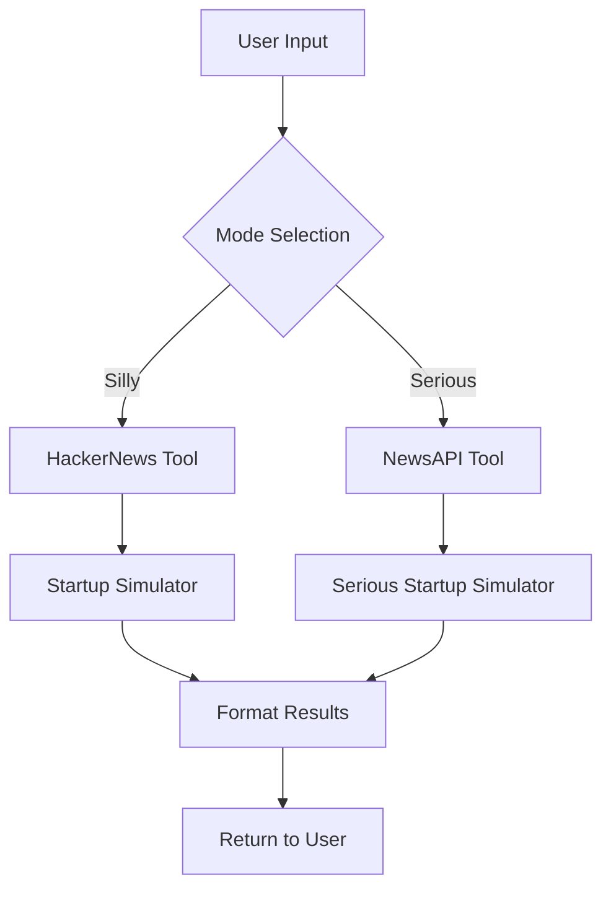

# 🎓 Startup Sim 3000 Tutorial: Building an AI-Powered Startup Pitch Generator

Welcome to the comprehensive tutorial for **Startup Sim 3000**! This guide will walk you through building and understanding an AI-powered startup pitch generator with observability, step by step.

## 📚 What You'll Learn

By the end of this tutorial, you'll understand:
- How to build an agentic AI system with multiple tools
- Implementing proper observability with Galileo logging
- Creating dual-mode AI applications (Silly vs Serious)
- Building a modern web interface for AI applications
- Best practices for AI tool architecture and error handling

## 🎯 Tutorial Overview

This tutorial is organized into progressive levels:
- **🟢 Beginner**: Get the app running and understand basic concepts
- **🟡 Intermediate**: Learn the agent architecture and tool system
- **🔴 Advanced**: Implement custom tools and advanced features

---

## 🟢 **Level 1: Getting Started (Beginner)**

### Step 1: Environment Setup

First, let's set up your development environment:

```bash
# 1. Clone the repository
git clone https://github.com/erinmikailstaples/startup-sim-3000.git
cd startup-sim-3000

# 2. Create and activate virtual environment
python -m venv venv
source venv/bin/activate  # On Windows: venv\Scripts\activate

# 3. Install dependencies
pip install -r requirements.txt
```

### Step 2: Configure API Keys

Create your environment configuration:

```bash
# Copy the example environment file
cp .env.example .env

# Edit the .env file with your API keys
nano .env  # or use your preferred editor
```

Add these required keys to your `.env` file:

```env
# Required for AI functionality
OPENAI_API_KEY=your_openai_api_key_here
NEWS_API_KEY=your_newsapi_key_here

# Optional for observability (recommended)
GALILEO_API_KEY=your_galileo_api_key_here
GALILEO_PROJECT=startup-simulator-v1.2
GALILEO_LOG_STREAM=tutorial_stream
```

**Where to get API keys:**
- **OpenAI**: [https://platform.openai.com/api-keys](https://platform.openai.com/api-keys)
- **NewsAPI**: [https://newsapi.org/register](https://newsapi.org/register)
- **Galileo**: [https://console.galileo.ai/](https://console.galileo.ai/)

### Step 3: Test Your Setup

Run the CLI version to verify everything works:

```bash
python run_startup_sim.py
```

Try these inputs:
- **Industry**: `fintech`
- **Target audience**: `millennials`
- **Random word**: `blockchain`

You should see a creative startup pitch generated!

### Step 4: Launch the Web Interface

Start the web server:

```bash
python web_server.py
```

Open your browser and go to: `http://localhost:2021`

**🎮 Try Both Modes:**
- **Silly Mode 🎭**: Generates creative, humorous pitches
- **Serious Mode 💼**: Creates professional business plans

---

## 🟡 **Level 2: Understanding the Architecture (Intermediate)**

### Step 5: Agent Framework Deep Dive

Let's examine how the agent system works:

```python
# The main agent class (agent.py)
class SimpleAgent(Agent):
    def __init__(self, mode: str = "silly"):
        # Initialize with specific mode (silly or serious)
        self.mode = mode
        self._register_tools()  # Register available tools
```

**Key Concepts:**
- **Agent**: The "brain" that coordinates everything
- **Tools**: Specialized functions (HackerNews, NewsAPI, etc.)
- **Mode**: Determines which tools and approach to use
- **LLM Provider**: Handles AI model interactions

### Step 6: Tool System Architecture

The system uses different tools based on the selected mode:

**Silly Mode Tools:**
1. `HackerNewsTool` - Fetches trending tech stories for inspiration
2. `StartupSimulatorTool` - Generates creative, humorous pitches

**Serious Mode Tools:**
1. `NewsAPITool` - Fetches business news for market analysis  
2. `SeriousStartupSimulatorTool` - Creates professional business plans

### Step 7: Understanding Tool Execution Flow

Here's how a typical request flows through the system:



### Step 8: Observability with Galileo

The latest updates include enhanced Galileo logging using decorators:

```python
# New simplified approach using @log decorator
@log(span_type="tool", name="Tool-HackerNews")
async def execute(self, limit: int = 3) -> str:
    # Tool execution automatically creates spans
    # No manual span management needed!
```

**Benefits of the new approach:**
- ✅ Cleaner code with decorators
- ✅ Automatic span creation and management
- ✅ Better error handling and logging
- ✅ Consistent observability across all tools

### Step 9: Testing Individual Components

Test individual tools to understand their behavior:

```bash
# Test HackerNews tool
python -c "
import asyncio
from tools.hackernews_tool import HackerNewsTool
result = asyncio.run(HackerNewsTool().execute(limit=2))
print(result)
"

# Test NewsAPI tool
python -c "
import asyncio
from tools.news_api_tool import NewsAPITool
result = asyncio.run(NewsAPITool().execute(category='business', limit=2))
print(result)
"
```

### Step 10: Run the Comprehensive Test Suite

The project includes a comprehensive test suite for Galileo logging:

```bash
python test_galileo_tool_logging.py
```

This test will:
- ✅ Verify all environment variables
- ✅ Test both silly and serious modes
- ✅ Check individual tool functionality
- ✅ Validate Galileo span creation
- ✅ Ensure proper error handling

---

## 🔴 **Level 3: Advanced Implementation (Advanced)**

### Step 11: Creating Custom Tools

Let's create a custom tool. Here's the structure:

```python
# tools/custom_tool.py
from agent_framework.tools.base import BaseTool
from agent_framework.models import ToolMetadata
from galileo import log
from agent_framework.utils.logging import get_galileo_logger

class CustomTool(BaseTool):
    def __init__(self):
        super().__init__()
        self.name = "custom_tool"
        self.description = "Your custom tool description"
        self.galileo_logger = get_galileo_logger()

    @classmethod
    def get_metadata(cls) -> ToolMetadata:
        return ToolMetadata(
            name="custom_tool",
            description="Custom tool for specific functionality",
            tags=["custom", "example"],
            input_schema={
                "type": "object",
                "properties": {
                    "input_param": {
                        "type": "string",
                        "description": "Input parameter description"
                    }
                },
                "required": ["input_param"]
            },
            output_schema={
                "type": "string",
                "description": "JSON string with tool results"
            }
        )

    @log(span_type="tool", name="Tool-Custom")
    async def execute(self, input_param: str) -> str:
        # Your custom logic here
        result = {"output": f"Processed: {input_param}"}
        return json.dumps(result)
```

### Step 12: Advanced Galileo Integration

Implement advanced observability patterns:

```python
# Advanced span management with custom metadata
@log(span_type="tool", name="Tool-Advanced", metadata={"version": "2.0"})
async def advanced_execute(self, **kwargs) -> str:
    logger = self.galileo_logger
    
    # Create trace with custom metadata
    trace = logger.start_trace(
        f"Advanced Tool Execution",
        metadata={
            "tool_version": "2.0",
            "execution_mode": self.mode,
            "timestamp": datetime.now().isoformat()
        }
    )
    
    try:
        # Your tool logic with detailed logging
        logger.add_llm_span(
            input="Custom processing started",
            output="Processing complete",
            model="custom_processor",
            metadata={"custom_field": "value"}
        )
        
        # Conclude trace successfully
        logger.conclude(output="Success", duration_ns=0)
        
    except Exception as e:
        # Proper error handling with Galileo
        logger.conclude(output=str(e), duration_ns=0, error=True)
        raise e
```

### Step 13: Web Interface Customization

Customize the web interface for your needs:

```javascript
// static/js/app.js - Add custom functionality
function customFeature() {
    // Add your custom frontend logic
    console.log('Custom feature activated');
}

// Extend the existing form validation
function validateCustomInput(input) {
    // Your custom validation logic
    return input.length > 0;
}
```

### Step 14: Performance Optimization

Implement performance optimizations:

```python
# Use connection pooling for API calls
import aiohttp
from aiohttp_session import setup
from aiohttp_session.cookie_storage import EncryptedCookieStorage

class OptimizedTool(BaseTool):
    def __init__(self):
        super().__init__()
        self.session = None
    
    async def get_session(self):
        if not self.session:
            self.session = aiohttp.ClientSession(
                timeout=aiohttp.ClientTimeout(total=30),
                connector=aiohttp.TCPConnector(limit=100)
            )
        return self.session
    
    async def execute(self, **kwargs):
        session = await self.get_session()
        # Use persistent session for better performance
```

### Step 15: Error Handling and Resilience

Implement robust error handling:

```python
import asyncio
from tenacity import retry, stop_after_attempt, wait_exponential

class ResilientTool(BaseTool):
    @retry(
        stop=stop_after_attempt(3),
        wait=wait_exponential(multiplier=1, min=4, max=10)
    )
    @log(span_type="tool", name="Tool-Resilient")
    async def execute(self, **kwargs):
        try:
            # Your tool logic with automatic retries
            result = await self._execute_with_retry(**kwargs)
            return result
        except Exception as e:
            # Log error and re-raise
            if self.galileo_logger:
                self.galileo_logger.conclude(
                    output=f"Error after retries: {str(e)}", 
                    error=True
                )
            raise e
```

---

## 🔧 **Development Best Practices**

### Code Organization

```
startup-sim-3000/
├── agent.py                 # Main agent implementation
├── agent_framework/         # Core framework components
│   ├── agent.py            # Base agent class
│   ├── tools/              # Tool base classes
│   └── utils/              # Utility functions
├── tools/                   # Specific tool implementations
│   ├── hackernews_tool.py  # HackerNews integration
│   ├── news_api_tool.py    # NewsAPI integration
│   └── startup_simulator.py # Pitch generation
├── templates/               # Web interface templates
├── static/                  # CSS, JS, images
└── tests/                   # Test files
```

### Environment Management

```bash
# Development environment
export ENVIRONMENT=development
export DEBUG=true
export LOG_LEVEL=debug

# Production environment  
export ENVIRONMENT=production
export DEBUG=false
export LOG_LEVEL=info
```

### Testing Strategy

```bash
# Run all tests
python -m pytest tests/

# Test specific components
python test_galileo_tool_logging.py

# Integration tests
python -m pytest tests/integration/

# Performance tests
python -m pytest tests/performance/ --benchmark
```

---

## 🚀 **Deployment Guide**

### Docker Deployment

Create a `Dockerfile`:

```dockerfile
FROM python:3.9-slim

WORKDIR /app
COPY requirements.txt .
RUN pip install -r requirements.txt

COPY . .
EXPOSE 2021

CMD ["python", "web_server.py"]
```

Build and run:

```bash
docker build -t startup-sim-3000 .
docker run -p 2021:2021 --env-file .env startup-sim-3000
```

### Cloud Deployment (AWS/GCP/Azure)

```bash
# Example for AWS EC2
# 1. Launch EC2 instance
# 2. Install dependencies
sudo yum update -y
sudo yum install python3 python3-pip git -y

# 3. Clone and setup
git clone your-repo
cd startup-sim-3000
pip3 install -r requirements.txt

# 4. Configure environment variables
# 5. Run with process manager
pip3 install gunicorn
gunicorn -w 4 -b 0.0.0.0:2021 web_server:app
```

---

## 🎯 **Next Steps and Extensions**

### Potential Enhancements

1. **Multi-language Support**: Add internationalization
2. **User Authentication**: Implement user accounts and history
3. **Advanced Analytics**: Add detailed usage analytics
4. **API Rate Limiting**: Implement proper rate limiting
5. **Caching Layer**: Add Redis for improved performance
6. **Real-time Updates**: WebSocket support for live updates

### Learning Resources

- **Agent Framework**: Study the `agent_framework/` directory
- **Galileo Documentation**: [https://docs.galileo.ai/](https://docs.galileo.ai/)
- **OpenAI API**: [https://platform.openai.com/docs](https://platform.openai.com/docs)
- **Async Python**: Learn about `asyncio` and `aiohttp`

### Community and Support

- **GitHub Issues**: Report bugs and request features
- **Documentation**: Contribute to documentation improvements
- **Code Reviews**: Submit pull requests for enhancements

---

## 🎉 **Congratulations!**

You've completed the Startup Sim 3000 tutorial! You now understand:

✅ **Agent Architecture**: How AI agents coordinate multiple tools  
✅ **Tool Development**: Creating and integrating custom tools  
✅ **Observability**: Implementing proper logging and monitoring  
✅ **Web Development**: Building modern AI-powered web applications  
✅ **Best Practices**: Code organization, testing, and deployment  

### What's Next?

1. **Experiment**: Try building your own custom tools
2. **Contribute**: Submit improvements to the project
3. **Learn More**: Explore advanced AI agent patterns
4. **Build**: Create your own AI-powered applications

Happy coding! 🚀

---

## 📖 **Appendix: Recent Updates**

### Latest Changes (July 2025)

The recent updates include significant improvements to the Galileo logging system:

#### 🔄 **Simplified Tool Span Logging**
- **Before**: Manual span creation with `logger.add_llm_span()`
- **After**: Clean decorator approach with `@log(span_type="tool")`

```python
# Old approach (removed)
logger.add_llm_span(
    input=f"Fetching {limit} trending HackerNews stories",
    output="Tool execution started",
    model="hackernews_api",
    # ... more manual configuration
)

# New approach (current)
@log(span_type="tool", name="Tool-HackerNews")
async def execute(self, limit: int = 3) -> str:
    # Automatic span creation and management!
```

#### 🧪 **Enhanced Testing Framework**
- New comprehensive test suite in `test_galileo_tool_logging.py`
- Tests both individual tools and full agent workflows
- Validates proper span hierarchy and error handling
- Provides detailed observability verification

#### 🏗️ **Improved Architecture**
- Cleaner separation of concerns between tools and agents
- Better error handling with automatic span conclusion
- Consistent JSON output formatting across all tools
- Enhanced metadata tracking for better observability

#### 🔍 **Better Observability**
- Structured logging with consistent JSON format
- Proper parent-child span relationships
- Rich metadata on each span for debugging
- Automatic error tracking and span completion

These updates make the codebase more maintainable, observable, and easier to extend with new tools and functionality.