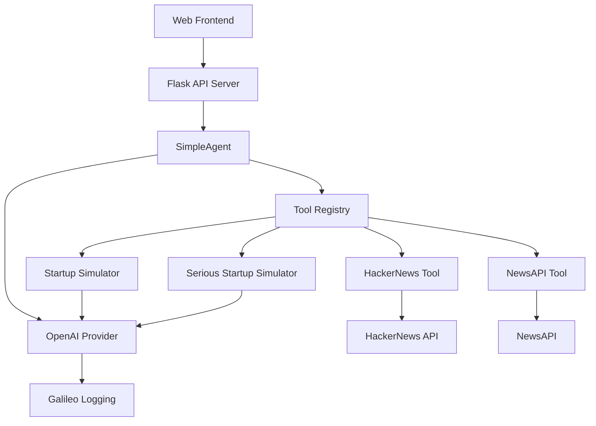

# 🚀 Startum Sim 3000

An 8-bit styled AI-powered startup pitch generator that creates either silly, creative pitches or professional business proposals. Built with an agentic framework powered by OpenAI and monitored with Galileo observability.


## ✨ Features

### 🎭 Dual Modes
- **Silly Mode**: Generates absurd, creative startup pitches inspired by HackerNews trends
- **Serious Mode**: Creates professional, corporate business proposals with market analysis from NewsAPI

### 🎮 8-bit Web Interface
- Retro pixel art styling with vibrant color scheme
- Animated backgrounds and glowing text effects
- Responsive design for desktop and mobile
- Interactive mode selection and form validation

### 🤖 Agentic Framework
- Multi-tool agent architecture with LangChain integration
- Dynamic tool selection based on execution mode
- Comprehensive input validation and error handling
- Real-time context fetching from external APIs

### 📊 Galileo Observability
- Complete workflow and tool execution logging
- Structured JSON output for debugging and analysis
- LLM call tracking with token usage and performance metrics
- Distributed tracing across the entire execution pipeline

## 🏗️ Architecture



### Core Components

- **Agent Framework** (`agent_framework/`): Base agent architecture with tool registry and execution engine
- **Tools** (`tools/`): Modular tool implementations for different data sources and generators
- **Web Interface** (`templates/`, `static/`): 8-bit styled frontend with mode selection
- **CLI Interface** (`run_startup_sim.py`): Command-line version for direct agent interaction

## 🚀 Quick Start

### Prerequisites

- Python 3.8+
- OpenAI API Key
- NewsAPI Key (for serious mode)
- Galileo API Key (optional, for observability)

### Installation

1. **Clone the repository**
   ```bash
   git clone https://github.com/erinmikailstaples/startup-sim-3000.git
   cd startup-sim-3000
   ```

2. **Create virtual environment**
   ```bash
   python -m venv venv
   source venv/bin/activate  # On Windows: venv\Scripts\activate
   ```

3. **Install dependencies**
   ```bash
   pip install -r requirements.txt
   ```

4. **Set up environment variables**
   ```bash
   cp .env.example .env
   # Edit .env with your API keys
   ```

### Environment Variables

Create a `.env` file with the following variables:

```env
# Required
OPENAI_API_KEY=your_openai_api_key_here
NEWS_API_KEY=your_newsapi_key_here

# Optional (for Galileo observability)
GALILEO_API_KEY=your_galileo_api_key_here
```

#### API Key Sources
- **OpenAI API**: [https://platform.openai.com/api-keys](https://platform.openai.com/api-keys)
- **NewsAPI**: [https://newsapi.org/register](https://newsapi.org/register)
- **Galileo**: [https://console.galileo.ai/](https://console.galileo.ai/)

## 🎮 Usage

### Web Application (Recommended)

1. **Start the web server**
   ```bash
   python web_server.py
   ```

2. **Open your browser**
   ```
   http://localhost:2021
   ```

3. **Follow the interface**
   - Select mode (Silly 🎭 or Serious 💼)
   - Fill in industry, audience, and random word
   - Click "Generate Startup" and wait for results

### Command Line Interface

```bash
python run_startup_sim.py
```

Follow the prompts to enter:
- Industry (e.g., "fintech", "healthcare", "gaming")
- Target audience (e.g., "millennials", "small businesses", "developers")
- Random word (e.g., "blockchain", "unicorn", "synergy")

## 🛠️ Development

### Project Structure

```
startup-sim-3000/
├── agent_framework/           # Core agent architecture
│   ├── agent.py              # Base agent class
│   ├── models.py             # Data models and schemas
│   ├── llm/                  # LLM provider implementations
│   └── utils/                # Utilities and helpers
├── tools/                    # Tool implementations
│   ├── hackernews_tool.py    # HackerNews API integration
│   ├── news_api_tool.py      # NewsAPI integration
│   ├── startup_simulator.py  # Silly pitch generator
│   └── serious_startup_simulator.py  # Professional pitch generator
├── static/                   # Web assets
│   ├── css/style.css         # 8-bit styling
│   ├── js/app.js            # Frontend logic
│   └── images/              # Logo and assets
├── templates/                # HTML templates
│   └── index.html           # Main web interface
├── web_server.py            # Flask web server
├── run_startup_sim.py       # CLI entry point
└── agent.py                 # Main agent implementation
```

### Adding New Tools

1. **Create tool class** inheriting from `BaseTool`
2. **Implement required methods**: `get_metadata()` and `execute()`
3. **Register in agent** via `_register_tools()` method
4. **Add Galileo logging** with `@log` decorator

Example:
```python
from galileo import log
from agent_framework.tools.base import BaseTool

class MyTool(BaseTool):
    @log(span_type="tool", name="my_tool")
    async def execute(self, **inputs):
        # Tool implementation
        return {"result": "success"}
```

### Running Tests

Currently no test framework is configured. To add testing:

```bash
# Install pytest
pip install pytest pytest-asyncio

# Run tests (once implemented)
pytest tests/
```

## 📊 Observability

The application includes comprehensive Galileo logging:

### Trace Structure

```
WorkflowSpan: startup_simulator_main
└── WorkflowSpan: agent_execution
    ├── ToolSpan: hackernews_tool (silly mode)
    │   └── LlmSpan: OpenAI API call
    ├── ToolSpan: news_api_tool (serious mode)
    └── ToolSpan: startup_simulator/serious_startup_simulator
        └── LlmSpan: OpenAI GPT-4 call
```

### JSON Logging Format

All operations are logged as structured JSON:

```json
{
  "agent_id": "abc123-def456",
  "mode": "serious",
  "task": "Generate professional startup pitch...",
  "tools_used": ["news_api_tool", "serious_startup_simulator"],
  "execution_status": "success",
  "result_length": 485
}
```

## 🎨 Customization

### Styling

The 8-bit aesthetic uses CSS custom properties for easy theming:

```css
:root {
    --blue: #3498db;
    --red: #e74c3c;
    --orange: #f39c12;
    --green: #2ecc71;
    --navy: #1a1a2e;
}
```

### Mode Configuration

Add new modes by:
1. Creating new tool implementations
2. Updating `selectMode()` in `app.js`
3. Adding mode-specific logic in `agent.py`

## 📚 API Documentation

### Web API Endpoints

#### POST `/api/generate`

Generate a startup pitch based on input parameters.

**Request Body:**
```json
{
  "industry": "fintech",
  "audience": "millennials", 
  "randomWord": "blockchain",
  "mode": "serious"
}
```

**Response:**
```json
{
  "result": "Our synergistic blockchain platform leverages scalable infrastructure to deliver sustainable competitive advantages in the fintech ecosystem..."
}
```

### External APIs Used

- **OpenAI API**: [https://platform.openai.com/docs](https://platform.openai.com/docs)
- **NewsAPI**: [https://newsapi.org/docs](https://newsapi.org/docs)  
- **HackerNews API**: [https://github.com/HackerNews/API](https://github.com/HackerNews/API)
- **Galileo**: [https://docs.galileo.ai/](https://docs.galileo.ai/)

## 🤝 Contributing

1. Fork the repository
2. Create a feature branch (`git checkout -b feature/amazing-feature`)
3. Commit your changes (`git commit -m 'Add amazing feature'`)
4. Push to the branch (`git push origin feature/amazing-feature`)
5. Open a Pull Request

### Development Guidelines

- Follow existing code style and patterns
- Add Galileo logging to new tools with `@log` decorator
- Update this README for significant changes
- Test both silly and serious modes
- Ensure mobile responsiveness for frontend changes

## 🔧 Troubleshooting

### Common Issues

**"ModuleNotFoundError" errors**
```bash
# Ensure virtual environment is activated
source venv/bin/activate
pip install -r requirements.txt
```

**"API key not found" errors**
```bash
# Check .env file exists and contains required keys
cat .env
# Restart the application after adding keys
```

**Web interface not loading**
```bash
# Check Flask is running on correct port
python web_server.py
# Should show: Running on http://0.0.0.0:2021
```

**Tools not executing properly**
```bash
# Check tool registration in agent.py
# Verify API keys in .env file
# Check network connectivity for external APIs
```

## 📄 License

This project is licensed under the MIT License - see the [LICENSE](LICENSE) file for details.

## 🙏 Acknowledgments

- **Galileo** for providing observability infrastructure
- **OpenAI** for GPT-4 language model capabilities  
- **NewsAPI** for real-time business news data
- **HackerNews** for startup ecosystem insights
- Retro gaming community for 8-bit design inspiration

---

**Built with ❤️ by [Erin Mikail Staples](https://github.com/erinmikailstaples)**

*Powered by Galileo observability platform*
