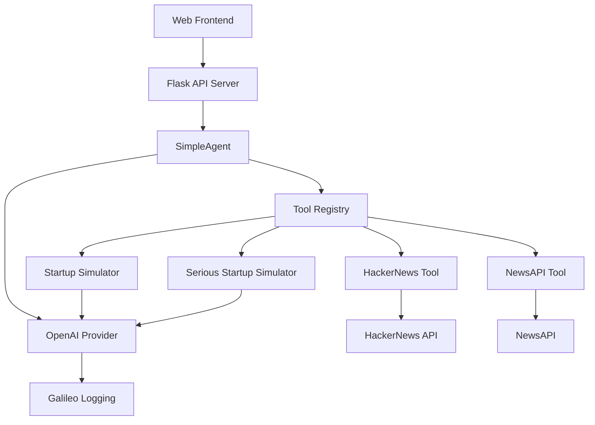

# 🚀 Startup Sim 3000

An 8-bit styled AI-powered startup pitch generator that creates either silly, 
creative pitches or professional business proposals. Built with a custom 
agentic framework powered by OpenAI and monitored with Galileo observability.

This project was built for the **[Databricks Data + AI Summit 2025](https://www.databricks.com/dataaisummit/session/generating-laughter-testing-and-evaluating-success-llms-comedy)** + presented by Erin Mikail Staples.  Watch the presentation [here](https://www.youtube.com/watch?v=zn5WvgZcdMA) or grab the slides [here](https://docs.google.com/presentation/d/1Mg99Bbjz5SCyzLdqfsw8kqw_d-RGU8cf-Xf4eUE2tXk/edit?usp=sharing).


## ✨ Features

### 🎭 Dual Modes

- **Silly Mode**: Generates absurd, creative startup pitches inspired by 
  HackerNews trends
- **Serious Mode**: Creates professional, corporate business proposals with 
  market analysis from NewsAPI

### 🎮 8-bit Web Interface

- Retro pixel art styling with vibrant color scheme
- Animated backgrounds and glowing text effects
- Responsive design for desktop and mobile
- Interactive mode selection and form validation

### 🤖 Agentic Framework

- Multi-tool agent architecture with LangChain integration
- Dynamic tool selection based on execution mode
- Comprehensive input validation and error handling
- Real-time context fetching from external APIs

### 📊 Galileo Observability

- Complete workflow and tool execution logging
- Structured JSON output for debugging and analysis
- LLM call tracking with token usage and performance metrics
- Distributed tracing across the entire execution pipeline
- Custom metrics evaluating the performance of the agent and tools

## 📋 Quick Reference

### ℹ️ Requirements

- Python 3.8+
- OpenAI API Key [Get one here](https://platform.openai.com/api-keys)
- NewsAPI Key (for serious mode) [Get one here](https://newsapi.org/register)
- A free account on [Galileo](https://app.galileo.ai/)
- A free account on [NewsAPI](https://newsapi.org/register)

### 🚀 Get Started Fast

```bash
# 1. Clone and setup
git clone https://github.com/erinmikailstaples/startup-sim-3000.git
cd startup-sim-3000
python -m venv venv && source venv/bin/activate
pip install -r requirements.txt

# 2. Add your API keys
cp .env.example .env
# Edit .env with your OpenAI and NewsAPI keys

# 3. Run the app
python web_server.py  # Web interface
# OR
python run_startup_sim.py  # CLI version
```

### 🎯 Common Commands

```bash
# Start web server
python web_server.py

# Run CLI version
python run_startup_sim.py

# Test a specific tool
python -c "import asyncio; from tools.startup_simulator import StartupSimulatorTool; print(asyncio.run(StartupSimulatorTool().execute('tech', 'developers', 'AI')))"

# Check if virtual environment is active
which python  # Should show path to venv/bin/python
```

### 🔧 Key Files

- `agent.py` - Main agent implementation
- `tools/` - Tool implementations
- `web_server.py` - Flask web server
- `static/js/app.js` - Frontend logic
- `templates/index.html` - Web interface

## 🏗️ Architecture

### How It Works (For Beginners)

Think of this application like a smart assistant that follows a recipe to cook 
up startup ideas! Here's the simple flow:

```
1. User Input → 2. Agent Planning → 3. Tool Execution → 4. Result Generation
```

#### Step 1: User Input

- You provide: Industry (e.g., "fintech"), Audience (e.g., "millennials"), 
  Random Word (e.g., "blockchain")
- The system decides which mode to use (Silly vs Serious)

#### Step 2: Agent Planning

- The AI agent analyzes your request
- It creates a step-by-step plan using available tools
- Think of this like a chef reading a recipe before cooking

#### Step 3: Tool Execution

- **Silly Mode**: Fetches HackerNews trends → Generates creative pitch
- **Serious Mode**: Fetches business news → Generates professional plan
- Each tool is like a specialized kitchen appliance

#### Step 4: Result Generation

- The agent combines all the results
- Formats the final startup pitch
- Returns it to you in a nice package

### Detailed Architecture



### Core Components Explained

**🎮 Web Interface (`templates/`, `static/`)**

- The beautiful 8-bit game-like interface you interact with
- Handles user input and displays results
- Built with HTML, CSS, and JavaScript

**🤖 Agent Framework (`agent_framework/`)**

- The "brain" of the system
- Manages tool selection and execution
- Handles communication between different parts

**🔧 Tools (`tools/`)**

- Specialized functions that do specific tasks:
  - `hackernews_tool.py`: Gets trending tech news
  - `news_api_tool.py`: Gets business market data
  - `startup_simulator.py`: Creates silly startup pitches
  - `serious_startup_simulator.py`: Creates professional business plans

**🌐 API Integration**

- `OpenAI`: Provides the AI language model (GPT-4)
- `NewsAPI`: Provides real-time business news
- `HackerNews`: Provides tech community trends
- `Galileo`: Monitors and logs everything (optional)

**📊 Observability**

- Every action is logged and tracked
- Helps debug issues and understand how the system works
- Provides insights into performance and usage

## 🚀 Quick Start

### Prerequisites

- Python 3.8+
- OpenAI API Key
- NewsAPI Key (for serious mode)
- Galileo API Key (optional, for observability)

### Step-by-Step Setup Guide

#### Step 1: Clone and Navigate

```bash
git clone https://github.com/erinmikailstaples/startup-sim-3000.git
cd startup-sim-3000
```

#### Step 2: Create Virtual Environment

```bash
# Create virtual environment
python -m venv venv

# Activate virtual environment
# On macOS/Linux:
source venv/bin/activate
# On Windows:
venv\Scripts\activate

# Verify activation (should show venv path)
which python  # macOS/Linux
where python  # Windows
```

#### Step 3: Install Dependencies

```bash
pip install -r requirements.txt
```

#### Step 4: Set Up Environment Variables

```bash
# Copy the example environment file
cp .env.example .env

# Edit the .env file with your API keys
# You can use any text editor:
nano .env  # or code .env, vim .env, etc.
```

#### Step 5: Get Your API Keys

**OpenAI API Key (Required):**

1. Go to [https://platform.openai.com/api-keys](https://platform.openai.com/api-keys)
2. Sign up/login to OpenAI
3. Click "Create new secret key"
4. Copy the key and paste it in your `.env` file

**NewsAPI Key (Required for Serious Mode):**

1. Go to [https://newsapi.org/register](https://newsapi.org/register)
2. Sign up for a free account
3. Copy your API key and paste it in your `.env` file

**Galileo API Key (Optional - for observability):**

1. Go to [https://console.galileo.ai/](https://console.galileo.ai/)
2. Sign up for an account
3. Create a new project and copy the API key

#### Step 6: Test Your Setup

```bash
# Test the CLI version first (simpler)
python run_startup_sim.py

# You should see prompts for:
# - Industry: (try "fintech")
# - Target audience: (try "millennials") 
# - Random word: (try "blockchain")
```

#### Step 7: Start the Web Application

```bash
python web_server.py
```

Open your browser and go to: `http://localhost:2021`

### Expected Outputs

**CLI Mode:**

```
Enter an industry: fintech
Enter a target audience: millennials
Enter a random word: blockchain
[Galileo logging info...]
🚀 Introducing CryptoSnack: The world's first blockchain-powered vending machine network...
```

**Web Mode:**

- Beautiful 8-bit styled interface
- Mode selection (Silly 🎭 vs Serious 💼)
- Form inputs with validation
- Animated loading sequence
- Generated startup pitch display

### Troubleshooting Common Issues

**"ModuleNotFoundError" or "No module named 'openai'":**

```bash
# Make sure your virtual environment is activated
source venv/bin/activate  # macOS/Linux
venv\Scripts\activate     # Windows

# Verify activation (should show venv path)
which python  # macOS/Linux
where python  # Windows

# Reinstall dependencies
pip install -r requirements.txt
```

**"API key not found" errors:**

```bash
# Check if .env file exists and has the right keys
cat .env

# Make sure there are no spaces around the = sign
# Correct: OPENAI_API_KEY=sk-1234567890abcdef
# Wrong:   OPENAI_API_KEY = sk-1234567890abcdef

# Verify the file is in the right location
ls -la .env  # Should show the file in project root

# Restart the application after adding keys
# The app only reads .env on startup
```

**"Port already in use" error:**

```bash
# The web server runs on port 2021
# If it's busy, you can change it in web_server.py
# Look for: app.run(debug=True, host='0.0.0.0', port=2021)

# Or kill the process using the port
lsof -ti:2021 | xargs kill -9  # macOS/Linux
# OR
netstat -ano | findstr :2021  # Windows (then kill the PID)
```

**Web interface not loading:**

```bash
# Check if Flask is running
python web_server.py
# Should show: Running on http://0.0.0.0:2021

# Try accessing: http://127.0.0.1:2021 instead of localhost

# Check browser console for JavaScript errors (F12)
# Look for CORS or network errors
```

**"Galileo API key not set" warning:**

```bash
# This is just a warning - the app will work without Galileo
# Galileo is optional for observability
# If you want to use it, add GALILEO_API_KEY to your .env file
```

**Tools not executing properly:**

```bash
# Check tool registration in agent.py
# Verify API keys in .env file
# Check network connectivity for external APIs

# Test individual tools:
python -c "import asyncio; from tools.hackernews_tool import HackerNewsTool; print(asyncio.run(HackerNewsTool().execute()))"

# Check logs for specific error messages
# Look for JSON output in console for debugging info
```

**"Permission denied" errors:**

```bash
# Make sure you have write permissions
chmod +x web_server.py
chmod +x run_startup_sim.py

# On Windows, run as administrator if needed
```

**Slow performance:**

```bash
# Check your internet connection
# OpenAI API calls can take 5-15 seconds
# HackerNews and NewsAPI calls add additional time
# Total generation time: 10-30 seconds is normal
```

**"Invalid mode" errors:**

```bash
# Only "silly" and "serious" modes are supported
# Check the mode parameter in your request
# Web interface should only show these two options
```

### Environment Variables

Create a `.env` file with the following variables:

```env
# Required
OPENAI_API_KEY=your_openai_api_key_here
NEWS_API_KEY=your_newsapi_key_here

# Optional (for Galileo observability)
GALILEO_API_KEY=your_galileo_api_key_here
GALILEO_PROJECT_ID=startup-simulator-v1.2
GALILEO_LOG_STREAM=my_log_stream

# Optional LLM configuration
LLM_MODEL=gpt-4
LLM_TEMPERATURE=0.7
```

#### API Key Sources

- **OpenAI API**: [https://platform.openai.com/api-keys](https://platform.openai.com/api-keys)
- **NewsAPI**: [https://newsapi.org/register](https://newsapi.org/register)
- **Galileo**: [https://console.galileo.ai/](https://console.galileo.ai/)

## 🎮 Usage

### Web Application (Recommended)

1. **Start the web server**

   ```bash
   python web_server.py
   ```

2. **Open your browser**

   ```
   http://localhost:2021
   ```

3. **Follow the interface**
   - Select mode (Silly 🎭 or Serious 💼)
   - Fill in industry, audience, and random word
   - Click "Generate Startup" and wait for results

### Command Line Interface

```bash
python run_startup_sim.py
```

Follow the prompts to enter:

- Industry (e.g., "fintech", "healthcare", "gaming")
- Target audience (e.g., "millennials", "small businesses", "developers")
- Random word (e.g., "blockchain", "unicorn", "synergy")

## 🎓 Learning Path

### 🟢 **Level 1: Just Want to Try It (Beginner)**

**Goal**: Get the app running and generate your first startup pitch

1. **Follow the Quick Start guide above**
2. **Try both modes**:
   - Silly Mode: Fun, creative pitches
   - Serious Mode: Professional business plans
3. **Experiment with different inputs**:
   - Industry: "gaming", "healthcare", "education"
   - Audience: "teenagers", "small businesses", "developers"
   - Random Word: "AI", "blockchain", "sustainability"

**What you'll learn**: How AI can generate creative content and the basics of 
API integration

### 🟡 **Level 2: Understand How It Works (Intermediate)**

**Goal**: Learn about the agentic framework and tool architecture

1. **Read the code structure**:
   - Start with `agent.py` (main agent logic)
   - Look at `tools/startup_simulator.py` (how tools work)
   - Examine `web_server.py` (how the web interface connects)

2. **Try the CLI version**:

   ```bash
   python run_startup_sim.py
   ```

3. **Add a simple tool** (see "Adding New Tools" section below)

**What you'll learn**: Agentic AI patterns, tool development, and async 
programming

### 🔴 **Level 3: Customize and Extend (Advanced)**

**Goal**: Build your own features and understand the full architecture

1. **Study the agent framework**:
   - `agent_framework/agent.py` (base agent class)
   - `agent_framework/tools/base.py` (tool interface)
   - `agent_framework/llm/` (LLM provider system)

2. **Add new modes**:
   - Create new tool combinations
   - Modify the web interface
   - Add new API integrations

3. **Explore observability**:
   - Set up Galileo monitoring
   - Analyze the JSON logs
   - Understand the trace structure

**What you'll learn**: Advanced AI system design, observability patterns, and 
production-ready architectures

## 🛠️ Development Guide

### Adding New Tools

Tools are the building blocks of your agent. Here's how to create one:

#### Step 1: Create Your Tool File

Create a new file in the `tools/` directory:

```python
# tools/my_custom_tool.py
import json
from typing import Dict, Any
from galileo import log
from agent_framework.tools.base import BaseTool
from agent_framework.models import ToolMetadata

class MyCustomTool(BaseTool):
    """
    Example tool that demonstrates the basic structure.
    Replace the placeholder logic with your actual functionality!
    """
    
    @classmethod
    def get_metadata(cls) -> ToolMetadata:
        """Define what your tool does and how to use it"""
        return ToolMetadata(
            name="my_custom_tool",
            description="What your tool does (used by agent for tool selection)",
            tags=["your", "tags", "here"],
            input_schema={
                "type": "object",
                "properties": {
                    "input_param": {
                        "type": "string", 
                        "description": "What this parameter does"
                    }
                },
                "required": ["input_param"]
            },
            output_schema={
                "type": "object",
                "properties": {
                    "result": {
                        "type": "string",
                        "description": "What your tool returns"
                    }
                },
                "required": ["result"]
            }
        )

    @log(span_type="tool", name="my_custom_tool")
    async def execute(self, input_param: str) -> Dict[str, Any]:
        """
        The main work your tool performs.
        
        Args:
            input_param: Your input parameter
            
        Returns:
            Dictionary with your results
        """
        try:
            # Log inputs for observability
            inputs = {"input_param": input_param}
            print(f"My Tool Inputs: {json.dumps(inputs, indent=2)}")
            
            # Your tool logic here
            result = f"Processed: {input_param}"
            
            # Prepare output
            output = {"result": result}
            
            # Log outputs for observability
            print(f"My Tool Output: {json.dumps(output, indent=2)}")
            
            return output
            
        except Exception as e:
            print(f"Tool Error: {e}")
            raise

# Test your tool
if __name__ == "__main__":
    import asyncio
    
    async def test():
        tool = MyCustomTool()
        result = await tool.execute("test input")
        print(f"✅ Test result: {result}")
    
    asyncio.run(test())
```

#### Step 2: Register Your Tool

Add your tool to the agent in `agent.py`:

```python
# In the _register_tools method, add:
from tools.my_custom_tool import MyCustomTool

self.tool_registry.register(
    metadata=MyCustomTool.get_metadata(),
    implementation=MyCustomTool
)
```

#### Step 3: Test Your Tool

```bash
# Test your tool directly
python tools/my_custom_tool.py

# Test through the agent
python run_startup_sim.py
```

### Example: Weather Tool

Here's a complete example of adding a weather tool:

```python
# tools/weather_tool.py
from galileo import log
from agent_framework.tools.base import BaseTool
from agent_framework.models import ToolMetadata

class WeatherTool(BaseTool):
    @classmethod
    def get_metadata(cls) -> ToolMetadata:
        return ToolMetadata(
            name="weather_tool",
            description="Get current weather for a location",
            tags=["weather", "api", "location"],
            input_schema={
                "type": "object",
                "properties": {
                    "city": {"type": "string", "description": "City name"}
                },
                "required": ["city"]
            },
            output_schema={
                "type": "object",
                "properties": {
                    "temperature": {"type": "number"},
                    "description": {"type": "string"},
                    "humidity": {"type": "number"}
                }
            }
        )

    @log(span_type="tool", name="weather_tool")
    async def execute(self, city: str) -> dict:
        # Mock implementation - replace with real weather API
        return {
            "temperature": 72.5,
            "description": "Partly cloudy",
            "humidity": 65
        }
```

### Modifying the Agent

#### Adding New Modes

To add a new mode (like "technical" or "creative"):

1. **Update the agent constructor**:

   ```python
   # In agent.py
   def __init__(self, mode: str = "silly"):
       if mode not in ["silly", "serious", "technical"]:
           raise ValueError(f"Invalid mode: {mode}")
       self.mode = mode
   ```

2. **Add mode-specific logic**:

   ```python
   # In the run method
   if self.mode == "technical":
       task = f"Generate a technical specification for a {industry} startup..."
   elif self.mode == "creative":
       task = f"Create an innovative concept for a {industry} company..."
   ```

3. **Update the web interface**:

   ```javascript
   // In static/js/app.js
   const modeOptions = {
       silly: { icon: "🎭", title: "SILLY MODE" },
       serious: { icon: "💼", title: "SERIOUS MODE" },
       technical: { icon: "⚙️", title: "TECHNICAL MODE" }
   };
   ```

### Customizing the Web Interface

#### Adding New UI Elements

1. **Update HTML template** (`templates/index.html`):

   ```html
   <!-- Add new mode option -->
   <div class="mode-option" id="technical-mode">
       <div class="mode-icon">⚙️</div>
       <div class="mode-title">TECHNICAL MODE</div>
       <div class="mode-desc">Generate technical specifications</div>
   </div>
   ```

2. **Update JavaScript** (`static/js/app.js`):

   ```javascript
   // Add event listener
   document.getElementById('technical-mode').addEventListener('click', () => {
       this.selectMode('technical');
   });
   ```

3. **Update CSS** (`static/css/style.css`):

   ```css
   /* Add styling for new elements */
   .technical-mode {
       background: linear-gradient(45deg, #2c3e50, #34495e);
   }
   ```

### Working with Observability

#### Understanding Galileo Logging

The application uses Galileo for comprehensive observability:

```python
# Basic logging
from galileo import log

@log(span_type="tool", name="my_tool")
async def my_tool_function():
    # This function will be automatically logged
    pass

# Custom logging
from galileo import GalileoLogger

logger = GalileoLogger(project="my-project", log_stream="my-stream")
trace = logger.start_trace(input="my input", name="my operation")
# ... do work ...
logger.conclude(output="my output")
```

#### Adding Custom Metrics

```python
# Track custom metrics
import time

async def my_tool():
    start_time = time.time()
    
    # ... do work ...
    
    execution_time = time.time() - start_time
    
    # Log custom metrics
    metrics = {
        "execution_time_seconds": execution_time,
        "input_size": len(input_data),
        "output_size": len(output_data)
    }
    
    print(f"Tool Metrics: {json.dumps(metrics, indent=2)}")
```

### Testing Your Changes

#### Manual Testing

```bash
# Test CLI
python run_startup_sim.py

# Test web interface
python web_server.py
# Then visit http://localhost:2021

# Test specific tool
python -c "import asyncio; from tools.my_custom_tool import MyCustomTool; print(asyncio.run(MyCustomTool().execute('test')))"
```

#### Unit Testing (Optional)

```python
# tests/test_my_tool.py
import pytest
import asyncio
from tools.my_custom_tool import MyCustomTool

@pytest.mark.asyncio
async def test_my_custom_tool():
    tool = MyCustomTool()
    result = await tool.execute(input_param="test")
    
    assert result["result"] == "Processed: test"
    assert "result" in result
```

## 🎯 Key Concepts to Master

**Agentic AI**: Systems that can plan and execute multi-step tasks

- **Planning**: Breaking down complex tasks into steps
- **Tool Selection**: Choosing the right tools for each step
- **Execution**: Running tools and handling results
- **State Management**: Keeping track of context and progress

**Tool Architecture**: Modular, reusable functions

- **Input/Output Schemas**: Defining what tools expect and return
- **Error Handling**: Graceful failure and recovery
- **Async Patterns**: Non-blocking operations for better performance

**Observability**: Understanding what your system is doing

- **Logging**: Recording events and data
- **Tracing**: Following requests through the system
- **Metrics**: Measuring performance and usage

## 📚 Next Steps After This Tutorial

1. **Build your own agent**: Create an agent for a different domain
2. **Add more tools**: Integrate with other APIs (Twitter, Reddit, etc.)
3. **Improve the UI**: Add more interactive features
4. **Deploy to production**: Set up hosting and monitoring
5. **Add testing**: Write unit and integration tests

## 🛠️ Project Structure

```
startup-sim-3000/
├── agent_framework/           # Core agent architecture
│   ├── agent.py              # Base agent class
│   ├── models.py             # Data models and schemas
│   ├── llm/                  # LLM provider implementations
│   └── utils/                # Utilities and helpers
├── tools/                    # Tool implementations
│   ├── hackernews_tool.py    # HackerNews API integration
│   ├── news_api_tool.py      # NewsAPI integration
│   ├── startup_simulator.py  # Silly pitch generator
│   └── serious_startup_simulator.py  # Professional pitch generator
├── static/                   # Web assets
│   ├── css/style.css         # 8-bit styling
│   ├── js/app.js            # Frontend logic
│   └── images/              # Logo and assets
├── templates/                # HTML templates
│   └── index.html           # Main web interface
├── web_server.py            # Flask web server
├── run_startup_sim.py       # CLI entry point
└── agent.py                 # Main agent implementation
```

## 📊 Observability

The application includes comprehensive Galileo logging:

### Trace Structure

```
WorkflowSpan: startup_simulator_main
└── WorkflowSpan: agent_execution
    ├── ToolSpan: hackernews_tool (silly mode)
    │   └── LlmSpan: OpenAI API call
    ├── ToolSpan: news_api_tool (serious mode)
    └── ToolSpan: startup_simulator/serious_startup_simulator
        └── LlmSpan: OpenAI GPT-4 call
```

### JSON Logging Format

All operations are logged as structured JSON:

```json
{
  "agent_id": "abc123-def456",
  "mode": "serious",
  "task": "Generate professional startup pitch...",
  "tools_used": ["news_api_tool", "serious_startup_simulator"],
  "execution_status": "success",
  "result_length": 485
}
```

## 🎨 Customization

### Styling

The 8-bit aesthetic uses CSS custom properties for easy theming:

```css
:root {
    --blue: #3498db;
    --red: #e74c3c;
    --orange: #f39c12;
    --green: #2ecc71;
    --navy: #1a1a2e;
}
```

### Mode Configuration

Add new modes by:

1. Creating new tool implementations
2. Updating `selectMode()` in `app.js`
3. Adding mode-specific logic in `agent.py`

## 📚 API Documentation

### Web API Endpoints

#### POST `/api/generate`

Generate a startup pitch based on input parameters.

**Request Body:**

```json
{
  "industry": "fintech",
  "audience": "millennials", 
  "randomWord": "blockchain",
  "mode": "serious"
}
```

**Response:**

```json
{
  "result": "Our synergistic blockchain platform leverages scalable infrastructure to deliver sustainable competitive advantages in the fintech ecosystem..."
}
```

### External APIs Used

- **OpenAI API**: [https://platform.openai.com/docs](https://platform.openai.com/docs)
- **NewsAPI**: [https://newsapi.org/docs](https://newsapi.org/docs)  
- **HackerNews API**: [https://github.com/HackerNews/API](https://github.com/HackerNews/API)
- **Galileo**: [https://docs.galileo.ai/](https://docs.galileo.ai/)

## 🤝 Contributing

1. Fork the repository
2. Create a feature branch (`git checkout -b feature/amazing-feature`)
3. Commit your changes (`git commit -m 'Add amazing feature'`)
4. Push to the branch (`git push origin feature/amazing-feature`)
5. Open a Pull Request

### Development Guidelines

- Follow existing code style and patterns
- Add Galileo logging to new tools with `@log` decorator
- Update this README for significant changes
- Test both silly and serious modes
- Ensure mobile responsiveness for frontend changes

## 🔧 Troubleshooting

### Common Issues

**"ModuleNotFoundError" errors**

```bash
# Ensure virtual environment is activated
source venv/bin/activate
pip install -r requirements.txt
```

**"API key not found" errors**

```bash
# Check .env file exists and contains required keys
cat .env

# Make sure there are no spaces around the = sign
# Correct: OPENAI_API_KEY=sk-1234567890abcdef
# Wrong:   OPENAI_API_KEY = sk-1234567890abcdef

# Verify the file is in the right location
ls -la .env  # Should show the file in project root

# Restart the application after adding keys
# The app only reads .env on startup
```

**Web interface not loading**

```bash
# Check Flask is running on correct port
python web_server.py
# Should show: Running on http://0.0.0.0:2021
```

**Tools not executing properly**

```bash
# Check tool registration in agent.py
# Verify API keys in .env file
# Check network connectivity for external APIs
```

## 📄 License

This project is licensed under the MIT License - see the [LICENSE](LICENSE) file 
for details.

## 🙏 Acknowledgments

- **Galileo** for providing observability infrastructure
- **OpenAI** for GPT-4 language model capabilities  
- **NewsAPI** for real-time business news data
- **HackerNews** for startup ecosystem insights
- Retro gaming community for 8-bit design inspiration

---

**Built with ❤️ by [Erin Mikail Staples](https://github.com/erinmikailstaples)**

*Powered by Galileo observability platform*
